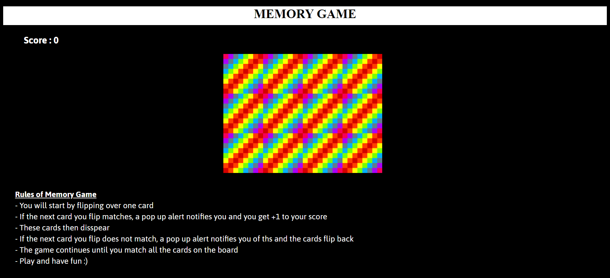
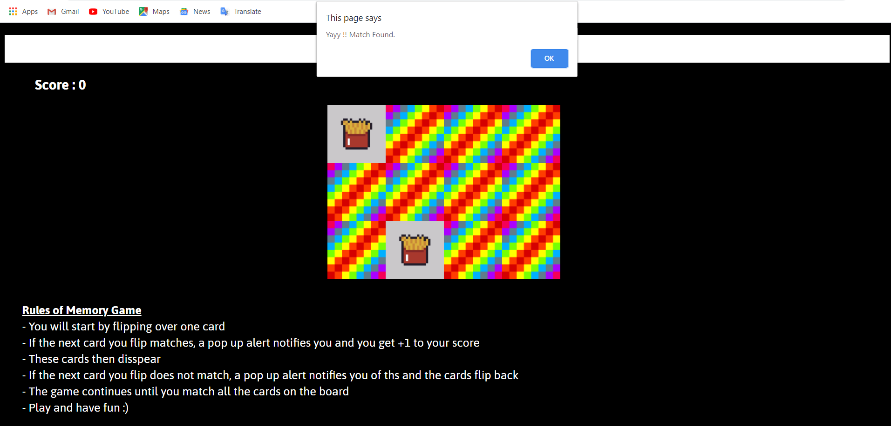
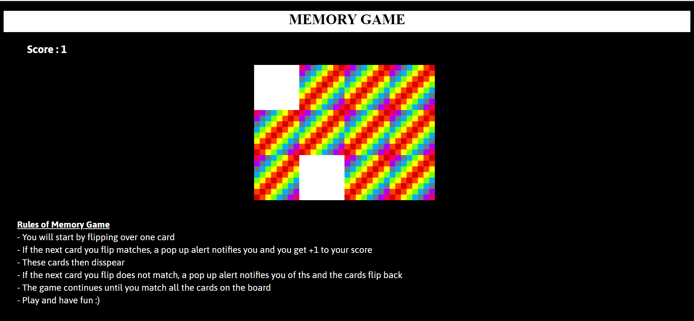

# Memory Map Game
A retro grid-based game in vanilla JavaScript, HTML and CSS

Memory Map Game, also known as the Concentration card game or Matching Game, is a simple card game where you need to match pairs by turn over 2 cards at a time. There are so many versions of it. It is hard to in down it's exact origin. There are claims that the famuos writer of Huckleberry Finn, Mark Twain invented his own version. I googled it and whatever it is, it looks more like a way of trying to figure out how much tax you owe rather than match cards.

To use this project follow the steps :
1. Clone the repo
2. Open index.html file in a browser.
3. I have kept the styling at a bare miniumum for you to go wild and make it your own.

## Rules of Memory Map Game
- You will start by flipping over one card
- If the next card you flip matches, a pop up alert notifies you and you get +1 to your score
- These cards then disspear
- If the next card you flip does not match, a pop up alert notifies you of ths and the cards flip back
- The game continues until you match all the cards on the board
- Play and have fun :)

# Overview of how the game looks

1. Front view of the game before starting.

2. When a match happens, a pop up window(alert) shows it was an match. And if it wasn't a pop would show a alert saying try again.

3. Scores getting updated as soon as they match. And matched cards getting removed.

*Play and have fun :)*
